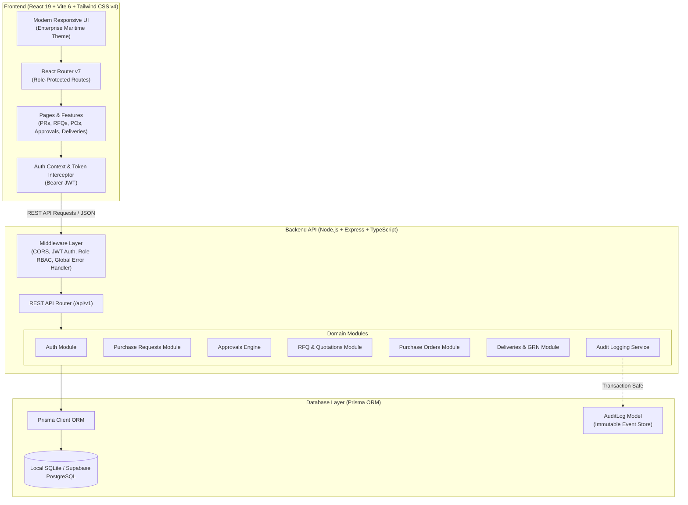
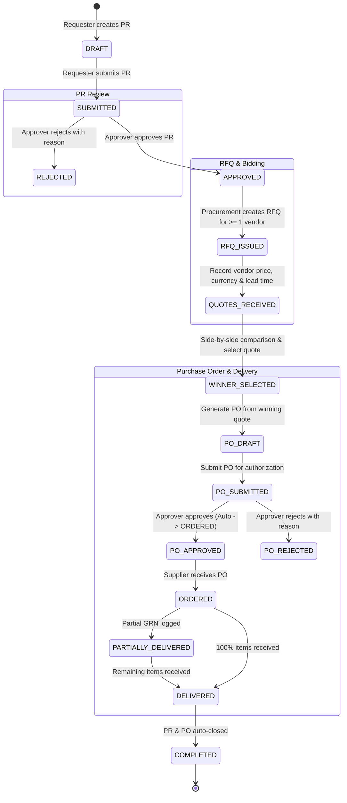
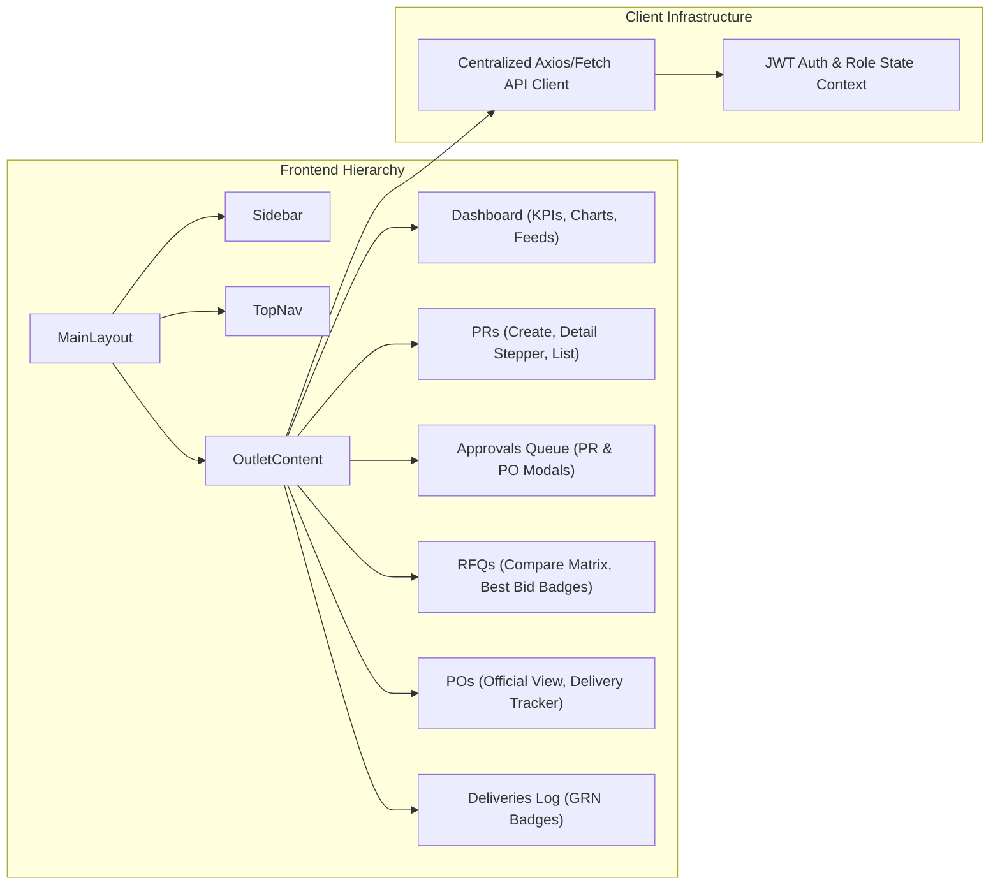
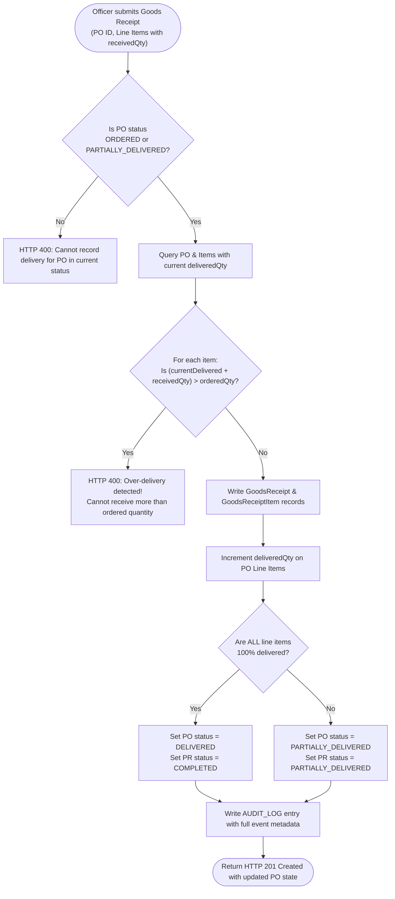

# 🚢 Maritime Procurement Management System ERP

> **Enterprise-Grade Maritime Fleet Procurement & Supply Chain ERP Prototype**  
> Built strictly adhering to the *AI-Agent-Ready Product Requirements Document (PRD)*.

[](https://www.typescriptlang.org/)
[](https://react.dev/)
[](https://vitejs.dev/)
[](https://tailwindcss.com/)
[](https://expressjs.com/)
[](https://www.prisma.io/)
[](https://sqlite.org/)

---

## 📌 Executive Summary

The **Maritime Procurement Management System** is a unified digital platform designed specifically for commercial vessel fleet operators, ship managers, procurement departments, and onboard crew (Chief Engineers / Captains). 

It replaces manual paper manifests, fragmented email chains, and disconnected spreadsheets with a **governed, auditable, and automated end-to-end procurement workflow**:
1. **Onboard Requisition (PR)** with automated line-item mathematics.
2. **Approval Workflows** with reason capture and status gates.
3. **Competitive Bidding (RFQ)** with multi-vendor distribution.
4. **Quotation Comparison Matrix** benchmarking unit prices, lead times, warranties, and payment terms with automated best-bid highlights.
5. **PO Issuance & Financial Approvals** with automated numbering (`PO-1001`).
6. **Delivery & Goods Receipt (GRN)** with **mathematically strict anti-over-delivery guards**, partial/full fulfillment tracking, and auto-closure.
7. **Immutable Audit Trail** capturing every single lifecycle mutation with actor, timestamp, and changes.

---

## 🏗️ Architecture & Information Flow

### 1. High-Level System Architecture



---

### 2. End-to-End Procurement Lifecycle State Machine



---

### 3. Component & Module Connection Hierarchy



---

### 4. Mathematical Anti-Over-Delivery Enforcement Logic



---

## 💻 Tech Stack Overview

| Layer | Technology | Description |
| :--- | :--- | :--- |
| **Frontend Framework** | **React 19** | Latest React features, hooks, strict mode, concurrent rendering |
| **Build Tool** | **Vite 6** | Ultra-fast HMR and optimized production bundling |
| **Styling & Design** | **Tailwind CSS v4** | Clean, accessible, modern maritime corporate theme (slate/blue) |
| **Icons** | **Lucide React** | Consistent, modern maritime & ERP icon system |
| **Routing** | **React Router v7** | Client-side routing with role-based access route guards |
| **Backend Runtime** | **Node.js 18+ / Express** | High-performance RESTful API with structured MVC architecture |
| **Language** | **TypeScript 5.7** | End-to-end type safety across backend and frontend |
| **ORM** | **Prisma ORM 6.4** | Type-safe database queries, schema migrations, and relations |
| **Database** | **SQLite (Local) / Supabase (Prod)** | Out-of-the-box zero-setup local database (`dev.db`) + Supabase PostgreSQL schema (`schema.postgresql.prisma`) |
| **Authentication** | **JWT + bcryptjs** | Stateless Bearer token authentication with password hashing |
| **Testing** | **Node Test Runner / Assert** | 16 comprehensive automated tests validating business rules |

---

## 👥 Role-Based Access Control (RBAC) Matrix

| Feature / Action | Requester *(Chief Engineer)* | Procurement Officer | Approver *(Procurement Mgr)* | Administrator *(Fleet Admin)* |
| :--- | :---: | :---: | :---: | :---: |
| **View Dashboard** | ✅ *(Filtered)* | ✅ | ✅ | ✅ |
| **Create / Edit Draft PR** | ✅ | ✅ | ❌ | ✅ |
| **Submit PR for Approval** | ✅ | ✅ | ❌ | ✅ |
| **Approve / Reject PR** | ❌ | ❌ | ✅ | ✅ |
| **Create RFQ & Add Vendors** | ❌ | ✅ | ❌ | ✅ |
| **Enter Quotations** | ❌ | ✅ | ❌ | ✅ |
| **Compare Quotes & Select Winner** | ❌ | ✅ | ❌ | ✅ |
| **Generate Purchase Order** | ❌ | ✅ | ❌ | ✅ |
| **Approve / Reject PO** | ❌ | ❌ | ✅ | ✅ |
| **Record Goods Receipts (GRN)** | ❌ | ✅ | ❌ | ✅ |
| **Manage Vessels Fleet** | 👁️ *(View)* | 👁️ *(View)* | 👁️ *(View)* | ✅ *(Full CRUD)* |
| **Manage Vendors** | ❌ | ✅ | 👁️ *(View)* | ✅ *(Full CRUD)* |
| **Manage Users & Roles** | ❌ | ❌ | ❌ | ✅ *(Full CRUD)* |
| **View System Audit Logs** | ❌ | 👁️ *(View)* | 👁️ *(View)* | ✅ *(Full View)* |

---

## 🔑 Pre-Seeded Demo Accounts

The system comes pre-populated with ready-to-use accounts for each PRD persona:

| Persona | Email | Password | Role | Primary Workspace |
| :--- | :--- | :--- | :--- | :--- |
| **Chief Engineer** | `chief.engineer@demo.com` | `Password123!` | `REQUESTER` | Vessel Requisitions & Status |
| **Procurement Officer** | `procurement@demo.com` | `Password123!` | `PROCUREMENT_OFFICER` | RFQs, Quotes, POs, Deliveries |
| **Procurement Manager** | `manager@demo.com` | `Password123!` | `APPROVER` | Pending Approvals & Budgets |
| **Fleet Administrator** | `admin@demo.com` | `Password123!` | `ADMIN` | Fleet, Users, Audit Logs |

> 💡 *Tip: The login page includes 1-click demo account selector buttons to quickly log in as any role without typing!*

---

## 🚀 Quick Start Guide

### Prerequisites
- [Node.js](https://nodejs.org/) version **18.0.0 or higher**
- `npm` package manager

### 1. Installation
Clone the repository and install dependencies in both backend and frontend:
```bash
# Clone the repository
git clone <repository-url>
cd procurementSystem

# Install backend dependencies
cd backend
npm install

# Install frontend dependencies
cd ../frontend
npm install
cd ..
```

### 2. Database Initialization
The project includes a pre-configured SQLite database setup for instant offline development.
```bash
cd backend
# Generate Prisma Client & push schema
npx prisma db push

# Seed master data (4 users, 4 vessels, 4 vendors, sample PRs, audit logs)
npm run seed
cd ..
```

### 3. Run Development Servers
Open two terminal windows or run using the root scripts:

**Terminal 1 (Backend API):**
```bash
cd backend
npm run dev
# Running on http://localhost:5000
```

**Terminal 2 (Frontend Client):**
```bash
cd frontend
npm run dev
# Running on http://localhost:5173
```

Now open your browser and navigate to **`http://localhost:5173`**.

---

## 🧪 Automated Testing

The backend includes a comprehensive automated test suite verifying 16 core business rules, including status progression, authorization gates, and anti-over-delivery math.

To execute the test suite:
```bash
cd backend
npm test
```

### Test Suite Coverage
```
✔ PR-1: Requester can create a draft PR with calculated total amount
✔ PR-2: Requester can submit PR for approval (transitions DRAFT -> SUBMITTED)
✔ PR-3: Non-approvers cannot approve a submitted PR (HTTP 403 Forbidden)
✔ PR-4: Approver can approve PR (transitions SUBMITTED -> APPROVED)
✔ PR-5: Approver can reject PR with mandatory reason
✔ RFQ-1: Procurement Officer can create RFQ from approved PR
✔ RFQ-2: Cannot attach duplicate vendors to same RFQ (HTTP 400 Bad Request)
✔ RFQ-3: Procurement Officer can record vendor quotations
✔ RFQ-4: Quote comparison matrix accurately calculates lowest price and fastest delivery
✔ RFQ-5: Procurement Officer can select winning quote
✔ PO-1: Generate PO from winning quotation with auto-incremented PO number
✔ PO-2: Approver can approve PO (transitions to APPROVED -> ORDERED)
✔ DELIV-1: Anti-Over-Delivery: Cannot receive more than ordered quantity (HTTP 400)
✔ DELIV-2: Partial delivery updates PO status to PARTIALLY_DELIVERED
✔ DELIV-3: Full delivery completes both Purchase Order and Purchase Request
✔ AUDIT-1: Audit log records actor, action, timestamp, and entity mutations
```

---

## 📖 End-to-End Walkthrough Scenario (PRD Section 45)

Follow this 5-minute interactive walkthrough to experience the entire procurement flow:

1. **Step 1: Sign in as Chief Engineer** (`chief.engineer@demo.com`)
   - Navigate to **Purchase Requests** → click **New Request**.
   - Select Vessel: `MV Ocean Star`.
   - Add Item: `Heavy Fuel Oil Filter Element`, Qty: `10`, Unit Price: `₹8,500`.
   - Click **Save & Submit for Approval**.
   
2. **Step 2: Sign in as Procurement Manager** (`manager@demo.com`)
   - Notice the **Approvals Queue** badge indicator.
   - Open the pending PR for MV Ocean Star.
   - Click **Approve Request** (optional remarks: *"Urgent engine maintenance"*).
   - Status updates to **APPROVED**.

3. **Step 3: Sign in as Procurement Officer** (`procurement@demo.com`)
   - Navigate to **RFQs & Quotes** → click **Create RFQ**.
   - Select the approved PR and select 3 vendors:
     - `ShipTech Marine Solutions`
     - `Oceanic Marine Supplies`
     - `Gulf Marine Services`
   - In RFQ Detail, click **Add Quotation** for each vendor:
     - ShipTech: `₹8,200/unit`, Lead time: `3 days`, Warranty: `12 months`.
     - Oceanic: `₹8,600/unit`, Lead time: `5 days`, Warranty: `6 months`.
     - Gulf Marine: `₹8,100/unit`, Lead time: `7 days`, Warranty: `6 months`.
   - View the **Comparison Matrix**: notice lowest price and fastest delivery badges.
   - Click **Select as Winner** on `ShipTech Marine Solutions`.
   - Click **Generate Purchase Order** → PO created (`PO-1001`).

4. **Step 4: Sign in as Procurement Manager** (`manager@demo.com`)
   - Go to **Approvals Queue** → **Purchase Orders** tab.
   - Click **Approve** on `PO-1001`.
   - PO status automatically transitions to **ORDERED**.

5. **Step 5: Sign in as Procurement Officer** (`procurement@demo.com`)
   - Go to **Purchase Orders** → open `PO-1001`.
   - Click **Record Delivery / Goods Receipt**.
   - Enter `10` units received, Condition: `GOOD`, Location: `Port of Singapore, Berth 4`.
   - Click **Save Goods Receipt**.
   - **Verification**:
     - Goods Receipt generated.
     - Line items show `10 / 10 Received (100%)`.
     - PO status advances to **DELIVERED**.
     - PR status advances to **COMPLETED**.
     - System Audit Log captures every single action chronologically.

---

## 📂 Project Structure

```
procurementSystem/
├── README.md                      # Comprehensive project documentation
├── package.json                   # Root scripts for monorepo operations
├── backend/                       # Express + Prisma Backend
│   ├── package.json
│   ├── tsconfig.json
│   ├── prisma/
│   │   ├── schema.prisma          # Active SQLite Prisma Schema
│   │   ├── schema.postgresql.prisma # Supabase PostgreSQL Schema
│   │   ├── seed.cjs               # Master data seeding script
│   │   └── dev.db                 # Seeded SQLite database file
│   └── src/
│       ├── config/prisma.ts       # Prisma client singleton
│       ├── types/index.ts         # Domain enums & interfaces
│       ├── middleware/auth.ts     # JWT validation & RBAC guards
│       ├── middleware/errorHandler.ts # Centralized JSON error handler
│       ├── utils/audit.ts         # Audit logging helper
│       ├── modules/               # Domain feature modules
│       │   ├── auth/              # Authentication & user profile
│       │   ├── users/             # User admin & role management
│       │   ├── vessels/           # Fleet master data
│       │   ├── vendors/           # Supplier directory
│       │   ├── purchaseRequests/  # PR creation, math, approval
│       │   ├── approvals/         # Approvals queue aggregation
│       │   ├── rfqs/              # RFQ distribution & quote matrix
│       │   ├── purchaseOrders/    # PO generation & approval
│       │   ├── deliveries/        # GRN logging & anti-over-delivery
│       │   ├── dashboard/         # Live metrics & recent activities
│       │   └── auditLogs/         # Compliance audit log query
│       ├── tests/workflow.test.ts # 16 automated business tests
│       ├── app.ts                 # Express application setup
│       └── server.ts              # Server entry point (Port 5000)
└── frontend/                      # React 19 + Vite 6 + Tailwind CSS v4
    ├── package.json
    ├── tsconfig.json
    ├── vite.config.ts
    ├── index.html
    └── src/
        ├── index.css              # Tailwind CSS styles & design tokens
        ├── vite-env.d.ts          # Vite typing declarations
        ├── types/index.ts         # Frontend TypeScript interfaces
        ├── services/api.ts        # Centralized Fetch API client with Bearer auth
        ├── context/AuthContext.tsx # User session & role context
        ├── layouts/MainLayout.tsx # Maritime ERP sidebar & header layout
        ├── components/            # Reusable UI components
        │   ├── StatusBadge.tsx    # State badge with colors
        │   ├── PriorityBadge.tsx  # Urgency badge
        │   ├── WorkflowStepper.tsx # Visual progress stepper
        │   ├── Card.tsx           # Standardized container
        │   └── Modal.tsx          # Accessible modal dialog
        ├── pages/                 # Full feature views
        │   ├── Login.tsx          # Login with 1-click demo helper
        │   ├── Dashboard.tsx      # Executive KPIs & live feed
        │   ├── PurchaseRequests/  # List, Create, Detail
        │   ├── Approvals/         # Approver queue for PRs & POs
        │   ├── Rfqs/              # RFQs list, Comparison Matrix
        │   ├── PurchaseOrders/    # PO list, PO Detail, GRN modal
        │   ├── Deliveries/        # Deliveries history
        │   ├── Vendors/           # Supplier directory
        │   ├── MasterData/        # Fleet vessels & user admin
        │   └── AuditLogs/         # Immutable audit trail view
        ├── App.tsx                # Role-guarded route definitions
        └── main.tsx               # Client entry point
```

---

## 🔒 Security & Compliance Highlights

- **Stateless Authentication**: JWT tokens with 24-hour expiration stored safely in client state.
- **Role-Based Routing**: Both client-side React routes and server-side Express endpoints strictly validate required permissions.
- **Audit Logging**: Every create, update, approve, reject, and delivery event is written to the `AuditLog` table with user ID, IP address, timestamp, and JSON before/after state.
- **Zero Silent Over-Deliveries**: Every Goods Receipt submission validates against remaining pending quantities in the database before incrementing inventory.

---

## 📄 License & Acknowledgments

Developed as an enterprise-grade prototype following maritime fleet procurement industry standards and the **Maritime Procurement Management System — AI-Agent-Ready PRD**.
