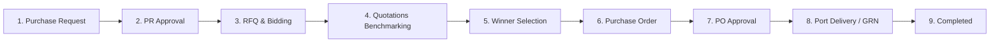
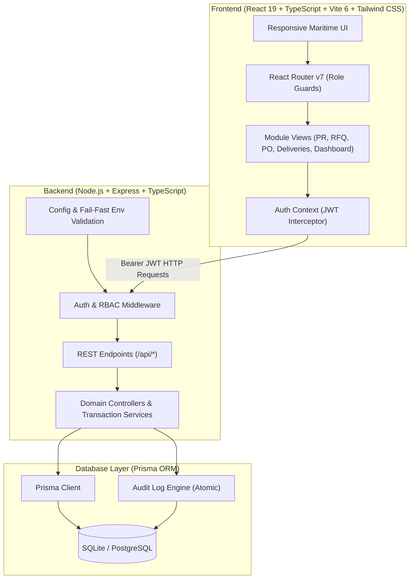
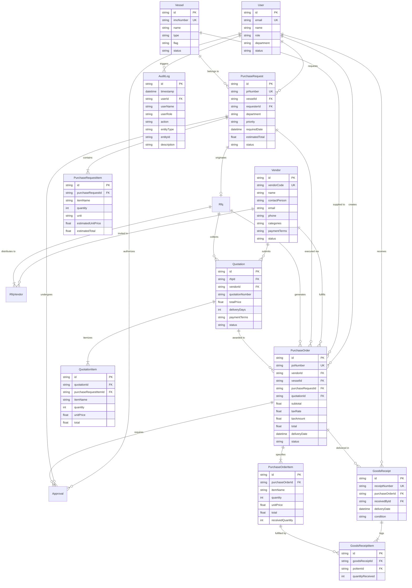

# 🚢 Maritime Procurement Management System

> **Full-Stack Maritime Fleet Procurement & Supply Chain ERP Prototype**  
> Built strictly adhering to the Maritime Procurement Management System specification, featuring end-to-end requisitions, RBAC governance, competitive bidding, quotation benchmarking, line-item pricing consistency, transaction-safe audit logging, and anti-over-delivery concurrency controls.

[](https://www.typescriptlang.org/)
[](https://react.dev/)
[](https://vitejs.dev/)
[](https://tailwindcss.com/)
[](https://expressjs.com/)
[](https://www.prisma.io/)
[](https://sqlite.org/)

---

## 1. Project Overview

The **Maritime Procurement Management System** is a full-stack ERP prototype engineered for commercial vessel fleet operators, ship management companies, procurement departments, and shipboard crew (Chief Engineers and Captains). 

In maritime operations, vessels require rapid, traceable provisioning of safety gear, engine spares, lubricants, and technical stores while docked in ports worldwide. This platform digitizes the procurement lifecycle into a structured, governed, and role-enforced workflow:
- **Onboard Requisition (PR)**: Vessel crew raise itemized technical requisitions with cost estimations.
- **Management Approval**: Department managers review and authorize requisitions with status gating.
- **Request for Quotation (RFQ)**: Procurement officers invite multiple approved marine vendors to bid.
- **Commercial & Technical Quote Evaluation**: Side-by-side comparison matrix highlighting pricing, lead times, and terms.
- **Purchase Order (PO)**: Automated PO creation copying vendor quoted line-item prices (preventing PR estimate leaks).
- **Goods Receipt (GRN) & Anti-Over-Delivery**: Strict concurrency-safe delivery logging supporting partial and full receipts.
- **Transaction-Safe Audit Trail**: Server-side audit logging capturing all mutations atomically.

---

## 2. Live Demo

The prototype is configured for rapid zero-config local execution (SQLite) and production deployment (Supabase PostgreSQL / Render / Vercel).

- **Local Frontend**: `http://localhost:5173`
- **Local API Server**: `http://localhost:5000`
- **API Health Check**: `http://localhost:5000/api/health`

---

## 3. Demo Credentials

The database is pre-seeded with four role-specific accounts. All demo accounts use the standard password:

🔑 **Default Password**: `Password123!`

| Role | Name | Email | Primary Responsibilities |
| :--- | :--- | :--- | :--- |
| **Chief Engineer** | Chief Engineer | `chief.engineer@demo.com` | Creates and submits onboard PRs for assigned vessels; views vessel requisitions. |
| **Procurement Officer** | Procurement Officer | `procurement@demo.com` | Creates RFQs, records vendor quotes, selects winning bids, generates POs, and logs port deliveries. |
| **Procurement Manager** | Procurement Manager | `manager@demo.com` | Reviews and authorizes PRs and POs; enforces financial governance. |
| **System Administrator** | System Administrator | `admin@demo.com` | Master data administration (vessels, users, vendors); global audit visibility and override rights. |

---

## 4. Core Procurement Workflow



1. **Requisition**: Chief Engineer raises a PR (e.g. 10 units of Heavy Fuel Oil Filter Elements for *MV Ocean Star*).
2. **Authorization**: Procurement Manager reviews and approves the PR.
3. **Sourcing**: Procurement Officer creates an RFQ inviting multiple marine suppliers (e.g. ShipTech Marine, MarineParts Ltd., Oceanic Supplies).
4. **Quotation**: Quotations are recorded with unit prices, lead times, and payment terms.
5. **Vendor Selection**: Commercial evaluation matrix compares bids; officer selects winning supplier with an audit rationale.
6. **Purchase Order**: PO is generated. Line items strictly inherit the selected vendor's quoted unit prices and line totals.
7. **PO Authorization**: Procurement Manager approves the PO, transitioning status to `ORDERED`.
8. **Delivery & GRN**: Port agent records goods receipt. The system supports partial deliveries and enforces atomic anti-over-delivery guards.
9. **Closure**: Once 100% of ordered quantities are received, PO and PR automatically transition to `COMPLETED`.

---

## 5. UI Walkthrough

The user interface is built with React 19, Tailwind CSS, and Lucide Maritime icons:
- **Operational Dashboard**: Role-scoped KPI cards (`Active POs`, `Pending Deliveries`, `Open RFQs`), pending approval queue, and recent activities.
- **PR Management & Item Builder**: Multi-line item requisition form with automated total calculations and priority badging.
- **Quote Comparison Matrix**: Side-by-side commercial comparison highlighting lowest bid, fastest delivery, and terms.
- **Goods Receipt Console**: Interactive delivery intake form with live remaining balance calculation and instant over-delivery rejection.
- **Audit Timeline**: Visual chronological history of every action, actor, timestamp, and justification.

---

## 6. Architecture



---

## 7. Database / ER Diagram

Mermaid Entity Relationship Diagram reflecting the active Prisma schema:



---

## 8. Roles & Permissions (RBAC Matrix)

Every state transition and data mutation is validated by server-side middleware (`requireRole`):

| Action | Requester | Procurement Officer | Approver / Manager | Fleet Admin |
| :--- | :---: | :---: | :---: | :---: |
| **Login / View Assigned PRs** | ✅ | ✅ | ✅ | ✅ |
| **Create & Submit PR** | ✅ | ❌ | ❌ | ✅ |
| **Approve / Reject PR** | ❌ *(Self-approval blocked)* | ❌ | ✅ | ✅ |
| **Create RFQ & Add Quotes** | ❌ | ✅ | ❌ | ✅ |
| **Select Winning Supplier** | ❌ | ✅ | ❌ | ✅ |
| **Generate Purchase Order** | ❌ | ✅ | ❌ | ✅ |
| **Approve / Reject PO** | ❌ | ❌ | ✅ | ✅ |
| **Log Port Delivery (GRN)** | ❌ | ✅ | ❌ | ✅ |
| **Access Full Audit Trail** | ❌ *(HTTP 403)* | ✅ | ✅ | ✅ |
| **Vessels & Master Data CRUD** | ❌ *(Read-only)* | ❌ *(Read-only)* | ❌ *(Read-only)* | ✅ *(Full CRUD)* |

---

## 9. Key Business Rules & Guard Invariants

1. **PO Price Inheritance**: PO line items inherit `unitPrice` and `total` directly from the selected vendor quotation, never from the PR estimated prices. Sum of line totals strictly equals PO subtotal.
2. **Conflict of Interest**: Requesters cannot approve their own purchase requests.
3. **RFQ State Guards**: Quotes can only be added to `OPEN` RFQs. Once a winner is selected, the RFQ closes and subsequent winner selections are rejected (HTTP 409).
4. **PO Deduplication**: A quotation or PR cannot generate multiple purchase orders (HTTP 409).
5. **Anti-Over-Delivery**: Delivery receipts cannot exceed ordered quantities (`receivedQuantity + newQuantity <= orderedQuantity`).
6. **Concurrency Protection**: Delivery intake reads fresh balances and updates increments atomically inside `prisma.$transaction`. Simultaneous delivery requests cannot over-deliver.
7. **Transaction-Safe Audit Trail**: In financial and state-changing mutations, business updates and audit logging execute within the same database transaction; if an audit log write fails, the entire transaction rolls back.
8. **Dashboard Data Scoping**: Requesters view only their own vessel requisitions and related orders.

---

## 10. Local Setup

### Prerequisites
- Node.js (v18+ recommended, v22 tested)
- npm

### Installation & Initialization

1. **Clone the repository**:
   ```bash
   git clone https://github.com/Rajan14-11/maritime-procurement-system.git
   cd maritime-procurement-system
   ```

2. **Install dependencies**:
   ```bash
   npm --prefix backend install
   npm --prefix frontend install
   ```

3. **Configure environment variables**:
   ```bash
   cp backend/.env.example backend/.env
   ```

4. **Initialize database schema and seed demo data**:
   ```bash
   npm --prefix backend run prisma:push
   npm --prefix backend run seed
   ```

5. **Start development servers**:
   - Backend API:
     ```bash
     npm --prefix backend run dev
     ```
   - Frontend UI:
     ```bash
     npm --prefix frontend run dev
     ```
   Open `http://localhost:5173` in your browser.

---

## 11. Environment Variables

Configure in `backend/.env`:

```env
PORT=5000
DATABASE_URL="file:./dev.db"
# For Supabase / PostgreSQL deployment:
# DATABASE_URL="postgresql://postgres:[PASSWORD]@[HOST]:5432/[DB_NAME]"
JWT_SECRET="replace-with-a-secure-random-jwt-secret-in-production"
FRONTEND_URL="http://localhost:5173"
NODE_ENV="development"
```

The server fails fast at startup if `JWT_SECRET` is missing.

---

## 12. Testing

The repository features automated test suites verifying business logic, role permissions, state machines, and concurrency safety:

```bash
npm --prefix backend test
```

### Test Coverage (40 Tests Total, 0 Failures):
- **Workflow Test Suite** (`workflow.test.ts`):
  - PR creation, line-item mathematics, approval transition
  - Multi-vendor RFQ creation and unique vendor constraint enforcement
  - Vendor quotation recording and winner selection
  - PO generation, approval to `ORDERED`
  - Goods receipt, partial delivery tracking (6/10), completion (10/10)
- **Adversarial & Invariant Security Test Suite** (`adversarial-guards.test.ts`):
  - Requester self-approval block (HTTP 403)
  - Non-approver permission block (HTTP 403)
  - Cross-user draft PR submission block (HTTP 403)
  - Unapproved PR RFQ creation block (HTTP 400)
  - Closed RFQ quote selection block (HTTP 400)
  - Duplicate winner selection block (HTTP 409)
  - Duplicate PO creation block (HTTP 409)
  - Inactive vendor block (HTTP 400)
  - Requester audit log access block (HTTP 403)
  - Anti-over-delivery quantity validation (HTTP 400)
  - Unapproved PO delivery block (HTTP 400)
  - PO price quotation inheritance verification
  - Concurrent delivery simulation stress test

---

## 13. Known Limitations

- **Email Dispatch**: External supplier RFQ invitations and PO emails are simulated in-app rather than sent via real SMTP gateways.
- **Identifier Generation**: Sequential numbering (`PR-1001`, `PO-1001`) relies on database count/latest sequence. In distributed high-concurrency clusters, database sequences or UUIDs are recommended.
- **Offline PWA**: Shipboard offline synchronization is not yet implemented; active connection to backend API is required.

---

## 14. Future Improvements

- **Supabase Production Migration**: Connect to managed Supabase PostgreSQL with read replicas.
- **PDF Generation**: Native PDF rendering of formal Maritime Purchase Orders and Goods Inspection Certificates.
- **Direct Vendor Portal**: Supplier portal allowing vendors to log in and submit bids directly through secure tokens.
- **Vessel Tracking**: AIS vessel location integration to recommend suppliers based on actual ship coordinates and port ETA.
