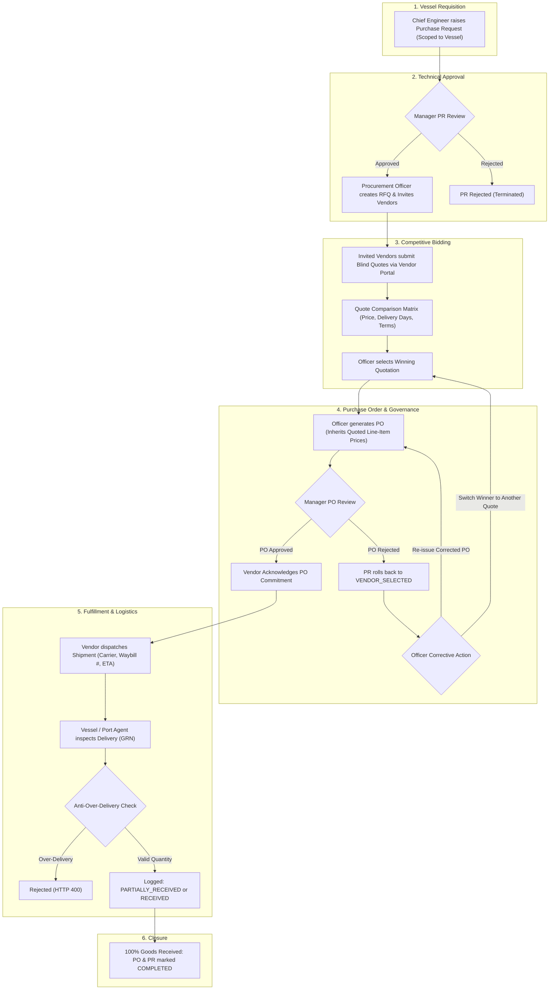
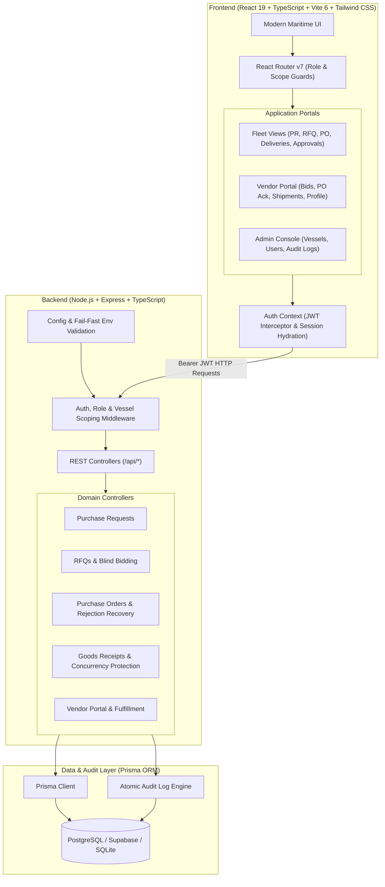
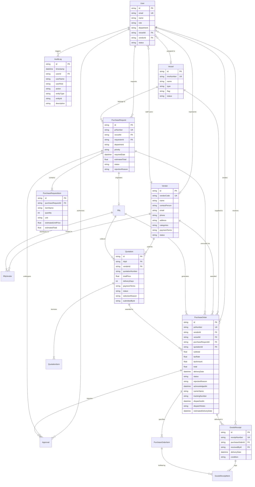

# 🚢 Maritime Procurement Management System

> **Full-Stack Maritime Fleet Procurement & Supply Chain ERP Prototype**  
> Built strictly adhering to the Maritime Procurement Management System specification, featuring end-to-end requisitions, RBAC governance, competitive bidding, quotation benchmarking, line-item pricing consistency, transaction-safe audit logging, anti-over-delivery concurrency controls, an integrated **Supplier Vendor Portal**, and **PO rejection lifecycle recovery**.

[](https://www.typescriptlang.org/)
[](https://react.dev/)
[](https://vitejs.dev/)
[](https://tailwindcss.com/)
[](https://expressjs.com/)
[](https://www.prisma.io/)
[](https://supabase.com/)

---

> 📚 **Deep-Dive Technical & Interview Documentation**:
> - ⚙️ **[Backend System Design, REST APIs & Prisma Engineering Guide](./docs/BACKEND_SYSTEM_DESIGN_AND_APIS.md)**: Detailed breakdown of all 30+ endpoints, Prisma query methods, interactive transactions, anti-over-delivery concurrency controls, and backend interview Q&A.
> - 💻 **[Frontend Architecture, Component Hierarchy & UI/UX Guide](./docs/FRONTEND_SYSTEM_DESIGN_AND_COMPONENTS.md)**: Comprehensive tour of React 19 architecture, session hydration, role-based routing, quotation comparison matrix, dynamic forms, and frontend interview Q&A.

---

## 1. Project Overview

The **Maritime Procurement Management System** is an enterprise-grade ERP prototype engineered for commercial vessel fleet operators, ship management companies, procurement departments, shipboard technical crew (Chief Engineers / Captains), and **commercial marine suppliers**.

In global fleet operations, ocean-going vessels require rapid, traceable provisioning of critical machinery spares, safety equipment, bunker fuels, lubricants, and technical stores while docked in international ports. This platform digitizes the procurement lifecycle into a structured, governed, role-enforced workflow:

- **Onboard Requisition (PR)**: Vessel crew raise itemized technical requisitions with estimated pricing, strictly scoped to their assigned vessel.
- **Management Authorization**: Technical and financial managers review and authorize or reject requisitions with role-enforced separation of duties.
- **Tender Sourcing (RFQ)**: Procurement officers issue RFQs inviting vetted marine vendors to bid on required line items.
- **Integrated Vendor Portal (Blind Bidding)**: Invited marine suppliers log in to submit itemized bids, lead times, and terms directly through a secure supplier portal. Vendors are blind to competitor bids.
- **Commercial & Technical Quote Evaluation**: Side-by-side comparison matrix benchmarks quotes by lowest price, fastest delivery, and commercial terms.
- **PO Generation & Price Inheritance**: Automated Purchase Order creation strictly inherits vendor-quoted unit prices and totals (preventing PR estimate leaks).
- **Management PO Authorization & Rejection Recovery**: Managers review commercial terms. If rejected, the PR status automatically rolls back to `VENDOR_SELECTED`, empowering the officer to re-issue corrected terms or switch winning vendors without terminating the requisition.
- **Supplier Order Acknowledgment & Shipment Tracking**: Awarded vendors acknowledge PO commitments, assign carriers, input waybill tracking numbers, and log dispatch notes.
- **Goods Receipt (GRN) & Anti-Over-Delivery**: Port agents and ship crew verify delivered quantities onboard with strict atomic anti-over-delivery guards.
- **Transaction-Safe Audit Trail**: Server-side audit logging captures all state mutations, financial events, and RBAC actions atomically.

---

## 2. Live Demo & Ports

The prototype is configured for local execution and managed cloud deployment:

- **Frontend Application**: `http://localhost:5173`
- **Backend API Server**: `http://localhost:5000`
- **API Health Check**: `http://localhost:5000/api/health`

---

## 3. Demo Credentials

The database is pre-seeded with role-specific accounts across all stakeholder personas, including internal fleet operators and external marine suppliers.

🔑 **Default Password for All Accounts**: `Password123!`

### Internal Fleet & Management Accounts
| Role | Name | Email | Primary Responsibilities |
| :--- | :--- | :--- | :--- |
| **Chief Engineer** | Chief Engineer | `chief.engineer@demo.com` | Creates and submits onboard PRs strictly scoped to assigned vessel (*MV Ocean Star*). |
| **Procurement Officer** | Procurement Officer | `procurement@demo.com` | Publishes RFQs, evaluates quote matrix, selects suppliers, generates POs, and logs port deliveries. |
| **Procurement Manager** | Procurement Manager | `manager@demo.com` | Reviews and authorizes PRs and POs; enforces financial governance and rejection feedback. |
| **System Administrator** | System Administrator | `admin@demo.com` | Master data administration (vessels, users, vendors); global audit visibility and override rights. |

### External Marine Supplier Accounts (Vendor Portal)
| Supplier Company | Vendor Code | Contact Email | Specialization |
| :--- | :--- | :--- | :--- |
| **MarineParts Ltd.** | `VEN-001` | `vendor@marineparts.com` | OEM Engine Spares, Purifier Discs & Fuel Filters |
| **OceanSupply Co.** | `VEN-002` | `vendor@oceansupply.com` | Deck Hardware, Mooring Lines & Safety Gear |
| **ShipTech Marine** | `VEN-003` | `vendor@shiptech.com` | Navigation Spares, Automation & Electronics |

---

## 4. End-to-End Procurement Workflow



### Detailed Workflow Stages:
1. **Requisition**: Chief Engineer submits an itemized PR (e.g. 10 units of Heavy Fuel Oil Filter Elements for *MV Ocean Star*).
2. **Authorization**: Procurement Manager reviews technical justification and authorizes the PR.
3. **Sourcing**: Procurement Officer initiates an RFQ, selecting vetted suppliers.
4. **Blind Bidding**: Invited suppliers log into the **Vendor Portal** to submit their quotation line items, delivery days, and payment terms. Competitor proposals are completely hidden.
5. **Evaluation & Award**: The officer reviews the Quote Comparison Matrix (benchmarking pricing, lead times, and terms) and selects the winner with an audit justification.
6. **PO Generation**: PO is drafted. Quoted unit prices and line totals are strictly locked into the PO.
7. **PO Governance & Rejection Recovery**:
   - **Approval**: Transitions PO status to `ORDERED`.
   - **Rejection**: If the manager rejects (e.g., *"Wrong seller"* or incorrect terms), the PR automatically reverts to `VENDOR_SELECTED`. The officer can either **Re-issue the Purchase Order** or **Switch Winner** to another quote in the matrix.
8. **Vendor Acknowledgment & Dispatch**: The awarded supplier acknowledges the PO and records courier tracking details (Carrier, Tracking Number, Dispatch Notes, and Estimated Delivery Date).
9. **Delivery & GRN**: Port agents or shipboard crew inspect deliveries upon arrival. The system allows partial receipts and rejects any quantity exceeding ordered amounts.
10. **Closure**: Once all ordered quantities are verified onboard, the PO and PR automatically transition to `COMPLETED`.

---

## 5. UI & Feature Walkthrough

The modern web application is crafted with React 19, Tailwind CSS, and Lucide Maritime icons:

### Role-Tailored Operational Dashboards
- **Chief Engineer**: Requisition tracker scoped strictly to their assigned vessel, quick PR creation shortcut, and vessel requisition statuses.
- **Procurement Officer**: Fleet procurement control center with RFQ response tracker, PO issuance queues, and delivery inspection intake.
- **Procurement Manager**: Authorizations queue with one-click review modals, financial expenditure summaries, and rejection feedback prompts.
- **Vendor Portal Dashboard**: Supplier fulfillment console displaying awarded purchase orders, RFQ invitation tenders, pending order acknowledgments, and logistics dispatch status.

### Quote Comparison Matrix
- Side-by-side evaluation table highlighting:
  - **Lowest Total Price** (green callout)
  - **Fastest Delivery Lead Time** (blue callout)
  - Commercial Payment Terms & Notes
  - **Switch Winner** capability if prior PO was rejected by management.

### Vendor Portal Interface (`/portal`)
- **Blind Bidding Workspace**: Invited vendors review vessel technical specs and submit itemized prices and lead times. Quotes can be revised up until the deadline.
- **Order Acknowledgment Console**: Formal review of commercial terms, line items, and delivery deadlines with an **Acknowledge Order** confirmation.
- **Shipment Dispatch Tracker**: Logistics modal allowing suppliers to input Carrier Name, Waybill / Tracking Number, Estimated Delivery Date, and packaging notes.
- **Delivery Inspection Transparency**: Vendors can view verified Goods Receipt notes recorded by port agents and shipboard crew.
- **Supplier Profile Self-Service**: Vendors can update company contact person, phone, warehouse address, and tax information.

### PO Rejection Alert & Stepper Integration
- Interactive **Workflow Stepper** reflecting current stage and displaying rose alert callouts when a PO is rejected.
- **PO Rejection Alert Banner** detailing manager rejection reasons with direct shortcuts to view the rejected PO and re-issue a corrected order.

---

## 6. Architecture



---

## 7. Database / ER Diagram

Mermaid Entity Relationship Diagram reflecting the active Prisma schema:



---

## 8. Roles & Permissions (RBAC Matrix)

Every state transition, financial mutation, and data query is validated by server-side middleware (`requireRole`, `requireVesselScope`, and `requireVendorScope`):

| Action | Chief Engineer | Procurement Officer | Approver / Manager | System Admin | Marine Vendor |
| :--- | :---: | :---: | :---: | :---: | :---: |
| **Login to System** | ✅ | ✅ | ✅ | ✅ | ✅ |
| **Create & Submit PR** | ✅ *(Assigned vessel only)* | ❌ | ❌ | ✅ | ❌ |
| **View Draft PRs** | ✅ *(Own drafts only)* | ❌ | ❌ | ✅ | ❌ |
| **Approve / Reject PR** | ❌ *(Self-approval blocked)* | ❌ | ✅ *(Peer review only; self-approval blocked)* | ✅ *(Peer review only; self-approval blocked)* | ❌ |
| **Create RFQ & Invite Vendors** | ❌ | ✅ | ❌ | ✅ | ❌ |
| **Submit Blind Quotation** | ❌ | ❌ | ❌ | ❌ | ✅ *(Invited RFQs only)* |
| **Select Winning Supplier** | ❌ | ✅ | ❌ | ✅ | ❌ |
| **Switch Winner on Rejection** | ❌ | ✅ | ❌ | ✅ | ❌ |
| **Generate / Re-issue PO** | ❌ | ✅ | ❌ | ✅ | ❌ |
| **Approve / Reject PO** | ❌ | ❌ | ✅ | ✅ | ❌ |
| **Acknowledge PO Commitment** | ❌ | ❌ | ❌ | ❌ | ✅ *(Awarded POs only)* |
| **Input Shipment Tracking & Dispatch**| ❌ | ❌ | ❌ | ❌ | ✅ *(Awarded POs only)* |
| **Log Port Delivery (GRN)** | ❌ | ✅ | ❌ | ✅ | ❌ |
| **View Goods Receipt Notes** | ✅ *(Assigned vessel)* | ✅ | ✅ | ✅ | ✅ *(Own POs only)* |
| **Access Global Audit Logs** | ❌ *(HTTP 403)* | ❌ *(Contextual only)* | ✅ *(Supervisory audit)* | ✅ *(Full system logs)* | ❌ *(HTTP 403)* |
| **Manage User Accounts** | ❌ | ✅ *(Vendor Portal accounts only)* | ❌ | ✅ *(All fleet roles & accounts)* | ❌ |
| **Manage Fleet Vessels** | ❌ *(Read-only)* | ❌ *(Read-only)* | ❌ *(Read-only)* | ✅ *(Full CRUD)* | ❌ |
| **Manage Vendor Company Profile** | ❌ | ❌ | ❌ | ✅ | ✅ *(Own company only)* |

---

## 9. Key Business Rules & Invariant Guards

1. **PO Price Quotation Inheritance**: Purchase Order line items inherit `unitPrice` and `total` directly from the selected vendor quotation, never from the PR estimated prices. Sum of line totals strictly equals PO subtotal.
2. **Universal Separation of Duties (SoD) & Conflict of Interest**: No user—including System Administrators and Managers—can approve their own purchase request (`pr.requesterId === req.user.id`). Peer authorization is strictly enforced across the backend and frontend to prevent unchecked financial commitments.
3. **RFQ Blind Bidding Guard**: Vendors can only view RFQs to which they have been explicitly invited and can only view their own quotations. Competitor pricing is completely obscured.
4. **PO Rejection Recovery Invariant**: When a manager rejects a PO, the PR status automatically reverts to `VENDOR_SELECTED`. The Procurement Officer can re-issue the PO or switch the winning supplier to another quote.
5. **PO Deduplication**: A quotation or PR cannot generate multiple active purchase orders (HTTP 409).
6. **Vessel-Scoped Requester Security**: Requesters are restricted to their assigned vessel (`User.vesselId`). Cross-vessel PR creation or viewing is strictly blocked (HTTP 403).
7. **Anti-Over-Delivery Enforcement**: Delivery receipts cannot exceed ordered quantities (`receivedQuantity + newQuantity <= orderedQuantity`).
8. **Concurrency Protection**: Delivery intake reads fresh balances and updates increments atomically inside `prisma.$transaction`. Simultaneous delivery requests cannot over-deliver.
9. **Transaction-Safe Audit Trail**: In financial and state-changing mutations, business updates and audit logging execute within the same database transaction; if an audit log write fails, the entire transaction rolls back.
10. **Future-Only Date Assignments**: Requisition required dates, quotation tender deadlines, PO delivery commitments, and Goods Receipt dates strictly reject past timestamps.
11. **Separation of Duties (SoD) for Audit Logs**: Global system audit logs (`/api/audit-logs`) are strictly restricted to `ADMIN` and `APPROVER` (Managers). Operational buyers (`PROCUREMENT_OFFICER`) and technical crew retain contextual audit trails on specific documents (PRs, RFQs, POs), but are barred from system-wide supervisory logs. Dashboard recent activity feeds for Procurement Officers strictly exclude internal staff user administration events.
12. **Scoped Vendor User Management**: Procurement Officers can provision and manage login credentials strictly for external marine suppliers (`role: VENDOR`). Internal staff accounts (Admins, Managers, Vessel Engineers) are completely excluded from both API responses and UI tables for Officers to prevent organizational data leakage.
13. **Deterministic Sequential RFQ Numbering**: RFQ numbering uses monotonic sequence scanning rather than record counting to prevent database unique constraint collisions under record deletions or seeded fixtures.
14. **Currency Standardization (₹ INR)**: Fleet requisitioning, quotation benchmarking, vendor bidding, and purchase orders are standardized in Indian Rupees (₹) across both buyer and vendor portals to eliminate commercial conversion ambiguity.

---

## 10. Local Setup & Execution

### Prerequisites
- **Node.js** (v18+ recommended, v22 tested)
- **npm** (v9+ recommended)

### Quick Start (Local Development)

1. **Clone the repository**:
   ```bash
   git clone https://github.com/Rajan14-11/maritime-procurement-system.git
   cd maritime-procurement-system
   ```

2. **Install dependencies**:
   ```bash
   npm --prefix backend install
   npm --prefix frontend install
   ```

3. **Configure environment variables**:
   ```bash
   cp backend/.env.example backend/.env
   ```

4. **Initialize database schema & seed demo accounts**:
   ```bash
   npm --prefix backend run prisma:generate
   npm --prefix backend run prisma:push
   npm --prefix backend run seed
   ```

5. **Start development servers**:
   - Backend API:
     ```bash
     npm --prefix backend run dev
     ```
   - Frontend UI:
     ```bash
     npm --prefix frontend run dev
     ```
   Open `http://localhost:5173` in your browser.

---

## 11. Environment Configuration

Configure in `backend/.env`:

```env
PORT=5000
DATABASE_URL="file:./dev.db"
# For Supabase / Managed PostgreSQL:
# DATABASE_URL="postgresql://postgres:[PASSWORD]@[HOST]:5432/[DB_NAME]?sslmode=require"
JWT_SECRET="super-secret-maritime-jwt-key-2026"
FRONTEND_URL="http://localhost:5173"
NODE_ENV="development"
```

The server fails fast at startup if `JWT_SECRET` is missing.

---

## 12. Automated Testing Suite

The codebase features comprehensive automated integration, state machine, RBAC security, and adversarial test suites:

```bash
npm --prefix backend test
```

### Test Coverage (84 Tests Total, 0 Failures):

- **Workflow Test Suite** (`workflow.test.ts` — 16 Tests):
  - PR lifecycle: draft creation, line-item calculations, and manager approval
  - Multi-vendor RFQ creation and unique vendor database constraint enforcement
  - Vendor quotation recording and winner selection
  - PO generation and approval transition to `ORDERED`
  - Goods receipt, partial delivery tracking (6/10), completion (10/10)
- **Adversarial & Invariant Security Test Suite** (`adversarial-guards.test.ts` — 37 Tests):
  - Requester self-approval block (HTTP 403)
  - Admin self-approval block (strict SoD returns HTTP 403)
  - Non-approver permission block (HTTP 403)
  - Cross-user draft PR submission block (HTTP 403)
  - Approver draft PR invisibility enforcement
  - Unapproved PR RFQ creation block (HTTP 400)
  - Deterministic sequential RFQ number generation (HTTP 201)
  - Inactive vendor RFQ inclusion block (HTTP 400)
  - Duplicate winner selection rejection (HTTP 409)
  - Closed RFQ selection block (HTTP 400)
  - Duplicate PO generation block (HTTP 409)
  - PO price quotation inheritance verification
  - Requester audit log endpoint access block (HTTP 403)
  - Procurement Officer global audit log endpoint access block (HTTP 403)
  - Procurement Officer user list scoped strictly to `VENDOR` accounts only
  - Admin and Manager global audit log access authorization (HTTP 200)
  - Procurement Officer dashboard activity feed exclusion of internal staff admin events
  - Anti-over-delivery quantity validation (HTTP 400)
  - Unapproved PO delivery block (HTTP 400)
  - Concurrent delivery race condition simulation test (atomic transaction validation)
  - Future-only date validation guards across PRs, RFQs, POs, and GRNs
- **Vessel-Scoped Requester Access Test Suite** (`vessel-access.test.ts` — 15 Tests):
  - Requester vessel list scoping (`GET /api/vessels`)
  - Foreign vessel direct access block (HTTP 403)
  - PR creation scoped to assigned vessel
  - Cross-vessel PR creation rejection (HTTP 403)
  - Cross-requester PR access block (HTTP 403)
  - Admin vessel assignment and audit logging (`VESSEL_ASSIGNMENT_CHANGED`)
  - Admin vessel CRUD operations
  - Procurement officer cross-fleet visibility verification
- **Vendor Portal & Fulfillment Test Suite** (`vendor-portal.test.ts` — 16 Tests):
  - Vendor account provisioning and supplier company linking
  - Scoped RFQ blind bidding and line-item submission
  - Quotation revision rules before tender deadline
  - Awarded PO release and supplier acknowledgment timestamping
  - Carrier name, waybill tracking number, and dispatch notes persistence
  - Goods receipt inspection onboard and supplier delivery receipt retrieval
  - Vendor self-service profile updates (contact, phone, warehouse address)

---

## 13. Known Limitations

- **Email Gateway**: RFQ invitations and PO release notifications are simulated in-app rather than transmitted via real SMTP/SendGrid gateways.
- **Offline PWA**: Shipboard offline synchronization for remote oceanic operation without internet is not yet implemented; an active network connection to the backend API is required.

---

## 14. Future Improvements

- **Native PDF Rendering**: PDF generation of formal Maritime Purchase Orders (BIMCO format) and Goods Inspection Certificates onboard.
- **Live AIS Ship Tracking**: Real-time AIS vessel position tracking to suggest port suppliers based on actual ship coordinates and ETA.
- **Multi-Currency Hedging**: Automated live exchange rate conversion for international port provisioning.
