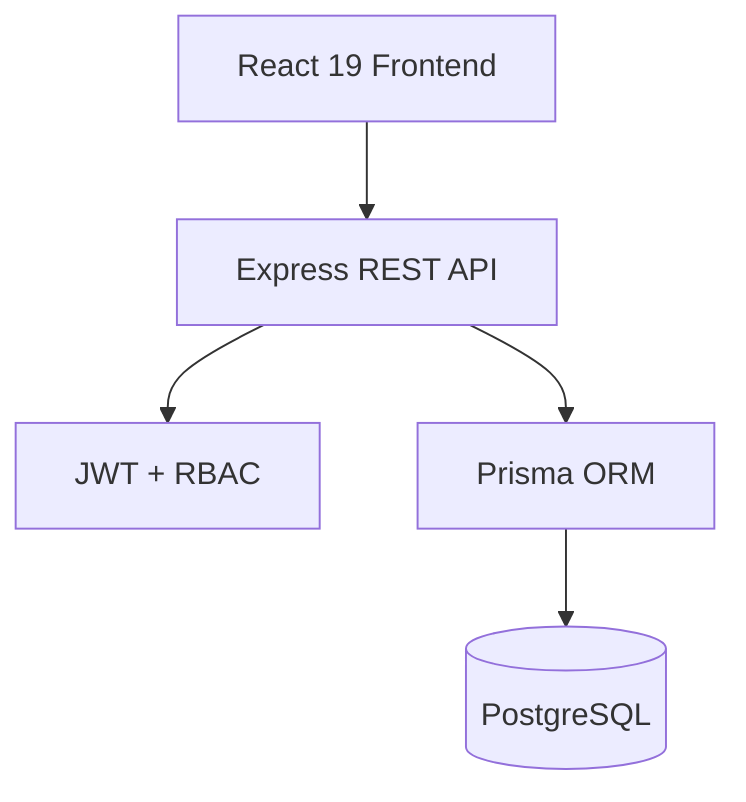
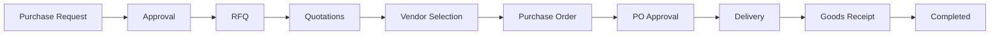

# Gemini Implementation Audit & Fix Specification

## Maritime Procurement Management System

**Purpose:** Controlled code-review and remediation instructions for an already-built MVP.

**Important:** This document is NOT a request to rebuild the project. The core end-to-end workflow already works. The goal is to inspect the existing repository, fix the prioritized correctness/security/data-model issues, improve documentation, and avoid scope creep.

---

# 1. Current Product Context

The product is a maritime procurement ERP prototype for a shipping company. The application supports four roles:

1. Chief Engineer / Requester
2. Procurement Officer
3. Approver / Procurement Manager
4. Administrator / Fleet Admin

Core workflow:

Purchase Request -> Approval -> RFQ -> Vendor Quotations -> Quote Comparison -> Vendor Selection -> Purchase Order -> PO Approval -> Ordering -> Delivery / GRN -> Completion

The application is already functional end-to-end. Preserve existing working behavior unless a change is required by this specification.

---

# 2. Current Technology Stack

Frontend:
- React 19
- TypeScript
- Vite
- React Router
- Tailwind CSS
- Centralized API client
- Auth context

Backend:
- Node.js
- Express
- TypeScript
- Prisma ORM
- JWT authentication
- bcrypt/bcryptjs password hashing

Database:
- Current development schema: SQLite
- Separate PostgreSQL schema exists for Supabase migration

Testing:
- Node test runner / assertions
- Existing workflow test suite covering the main procurement lifecycle

---

# 3. Working Functionality That Must Be Preserved

Do NOT remove or rewrite the following without a concrete reason:

- Login/logout
- JWT authentication
- Server-side RBAC middleware
- Chief Engineer / Requester PR creation
- PR submission and approval/rejection
- Vendor management
- RFQ creation
- Multiple vendors per RFQ
- Manual quotation entry
- Quote comparison
- Vendor selection
- PO generation
- PO approval/rejection
- Goods receipt
- Partial delivery
- Full delivery
- Anti-over-delivery validation
- Audit logging
- Dashboard metrics
- Existing automated business tests

The application should remain usable after every change.

---

# 4. CRITICAL PRINCIPLE FOR THIS TASK

Do NOT ask the AI agent to “improve the app” broadly.

Make changes in controlled phases.

For every phase:

1. Inspect relevant code first.
2. Explain the problem found.
3. Propose the minimal fix.
4. Implement only the necessary change.
5. Update/add tests.
6. Run the relevant tests.
7. Confirm existing workflow still works.
8. Do not introduce unrelated refactors.

If an item is already correctly implemented in the current repository, do not change it just because this document mentions it.

---

# 5. P0 — Fix PO Quotation / Line-Item Data Model

## Problem

The selected quotation currently has an overall total price, while the generated PO line items can inherit pricing from the original Purchase Request estimated prices rather than the selected vendor quotation price.

This can result in an inconsistent PO such as:

- Purchase Request: 10 x Rs 8,500 = Rs 85,000 estimated
- Vendor quotation: 10 x Rs 9,100 = Rs 91,000
- PO subtotal: Rs 91,000
- PO line item total: Rs 85,000

The PO must represent the selected supplier quotation, not the original estimated request price.

## Required behavior

When a quotation is selected and a PO is generated:

- PO line quantity must come from the quotation / requested quantity.
- PO unit price must come from the selected quotation.
- PO line total must be calculated from quantity x quoted unit price.
- PO subtotal must equal the sum of PO line totals.
- PO total must be derived from subtotal plus applicable tax/charges.
- The original PR estimated price must remain only an estimate and must not overwrite actual purchase price.

## Recommended model improvement

Preferred structure:

Quotation
  -> QuotationItem[]
      -> purchaseRequestItemId
      -> quantity
      -> unitPrice
      -> total

If the current MVP intentionally supports only one quotation line, implement the minimum consistent structure that still allows the PO to copy the actual vendor price reliably.

## Acceptance criteria

- Generate a PO from a selected quotation.
- Open the PO.
- Every PO line displays the vendor's quoted unit price.
- PO subtotal equals the sum of line totals.
- No line uses the PR's estimated unit price unless it is actually the same as the quotation price.
- Existing one-item demo flow still passes.
- Add at least one regression test with different estimated price vs quoted price.

---

# 6. P1 — Replace Financial Float Fields With Decimal / Fixed Precision

## Problem

Financial fields currently use floating point types in the Prisma schema.

For money, use fixed-precision Decimal values in PostgreSQL.

## Fields to review

Review all price, total, tax, and monetary fields such as:

- estimatedUnitPrice
- estimatedTotal
- quotation total / price
- PO subtotal
- tax rate / amount
- PO total

## Requirements

- Use Prisma Decimal for monetary values where supported.
- Ensure calculations are performed without binary floating-point money errors.
- API serialization should be deliberate and consistent.
- Frontend formatting should remain stable.

Do not introduce a complicated money library unless genuinely needed for the MVP.

## Acceptance criteria

- Money calculations remain accurate for common decimal values.
- Existing screens still display correct currency values.
- Existing tests pass.

---

# 7. P0 — Remove Hardcoded JWT Secret Fallback

## Problem

Authentication currently falls back to a hardcoded JWT secret when JWT_SECRET is absent.

This is unsafe for deployment.

## Required fix

The server must fail fast if JWT_SECRET is missing.

Preferred behavior:

```ts
const JWT_SECRET = process.env.JWT_SECRET;
if (!JWT_SECRET) {
  throw new Error('JWT_SECRET is required');
}
```

Do not silently fall back to a known secret.

## Environment requirements

Ensure `.env.example` contains:

```text
JWT_SECRET=replace-with-a-secure-secret
DATABASE_URL=...
PORT=5000
```

Never commit real production secrets.

---

# 8. P0 — Backend Audit Log Authorization

## Problem

Audit-log visibility must be enforced by the backend, not only by frontend route restrictions.

## Required behavior

Decide and document one of these policies:

Option A:
- ADMIN: full access
- APPROVER: read-only access
- PROCUREMENT_OFFICER: read-only access
- REQUESTER: no access

Option B:
- ADMIN only

For the MVP, Option A is acceptable if it matches the product UX.

## Requirement

The audit-log API endpoint must apply server-side role authorization.

A requester must not be able to call the API directly and retrieve audit logs merely because a frontend page is hidden.

## Acceptance criteria

- Authorized roles can access audit logs.
- Unauthorized role receives HTTP 403.
- Add an API-level test for the forbidden case.

---

# 9. P1 — Make Audit Logging Truly Transaction-Safe

## Problem

The audit helper currently catches audit-write failures and can allow the business operation to continue.

That contradicts a claim of a transaction-safe/immutable audit trail.

## Required behavior

For workflow mutations where audit logging is required:

Business update + audit log

must either:

- both succeed, or
- both fail/rollback.

Do not silently swallow an audit failure inside a required transaction.

## Implementation guidance

- Use the Prisma transaction client consistently.
- Let required audit failures propagate.
- Do not make audit logging silently best-effort for state-changing operations that are documented as audited.

## Documentation requirement

Do not call the audit trail “transaction-safe” or “immutable” unless the implementation actually satisfies that claim.

---

# 10. P1 — Fix Dashboard Metric Semantics

## Problem

The current dashboard has metrics such as Active POs and Pending Deliveries that may be driven by the same underlying status set, making them redundant.

## Required action

Inspect actual business meaning before changing the code.

Recommended options:

Option A:
- Remove the redundant KPI.

Option B:
- Redefine Pending Deliveries around expected/overdue delivery state/date while Active POs represents all open orders.

Do not create arbitrary formulas just to make numbers different.

## Acceptance criteria

Dashboard KPIs have distinct, understandable meanings and are backed by database queries.

---

# 11. P1 — Correct Role-Filtered Dashboard Behavior

## Problem

The product documentation describes the requester dashboard as filtered, but global counts may be returned to the requester.

## Required behavior

REQUESTER / CHIEF ENGINEER:
- Should see only appropriate requests / vessel-related information.

PROCUREMENT OFFICER / APPROVER / ADMIN:
- May see organization-level procurement metrics according to their permissions.

## Acceptance criteria

- Requester does not see unrelated procurement data.
- Backend applies the filtering; frontend hiding alone is insufficient.

---

# 12. P1 — Align Vessel RBAC

## Intended policy

Requester: View
Procurement Officer: View
Approver: View
Admin: Full CRUD

## Required fix

Make backend route authorization match the documented policy.

If the business logic intentionally differs, document the difference instead of silently leaving frontend/backend inconsistent.

---

# 13. P1 — Strengthen RFQ State Guards

## Problems to review

The quotation-selection operation should explicitly verify that:

- RFQ exists.
- RFQ is still open / selectable.
- Quotation belongs to that RFQ.
- Vendor is active.
- No quotation has already been selected for the RFQ.
- Purchase Request is still in a valid state for vendor selection.

## Required behavior

Invalid transitions must receive an appropriate 400/409 response.

Examples:

- Cannot select a quotation from a closed RFQ.
- Cannot select a second winner.
- Cannot select a quotation from another RFQ.

---

# 14. P1 — Prevent Duplicate / Repeated PO Creation

Inspect the PO generation endpoint.

The system must prevent creating multiple unintended POs from the same selected quotation.

At minimum:

- A quotation used for a PO should not generate another PO unless an explicit business rule allows it.
- The endpoint should reject duplicate generation with a clear 409/400 error.

Add a regression test.

---

# 15. P1 — Delivery Concurrency Review

The current delivery flow correctly validates against over-delivery during normal use.

However, inspect whether the read-modify-write sequence is concurrency-safe.

Potential scenario:

```text
Ordered = 10
Already Received = 4

Request A reads 4
Request B reads 4

Both attempt to receive 4
```

For the assignment, use the simplest safe solution supported by the current database/Prisma setup.

Do not over-engineer this into a distributed locking system.

At minimum, document the chosen consistency behavior.

---

# 16. P1 — Add Adversarial / Negative Tests

The current test suite covers the main workflow well. Add high-value edge tests.

Recommended additional tests:

1. Requester cannot approve own PR.
2. Non-approver cannot approve PR through API.
3. User cannot modify another user's restricted PR.
4. Cannot create RFQ from rejected request.
5. Cannot select quote from closed RFQ.
6. Cannot select a second winner.
7. Cannot create a second PO from the same selected quote.
8. Inactive vendor cannot be selected.
9. Requester cannot access restricted audit endpoint.
10. Cannot receive more than ordered quantity.
11. Cannot receive goods for an unapproved/unordered PO.
12. PO values match selected quotation values.

The goal is not to maximize test count. The goal is to cover business invariants.

---

# 17. P1 — Review Authentication and Authorization End-to-End

Verify all roles through both UI and direct API calls.

## Chief Engineer / Requester

Allowed:
- Login
- Create PR
- Submit own PR
- View appropriate requests

Denied:
- Approve PR
- Create RFQ
- Select vendor
- Approve PO
- Read restricted audit logs

## Procurement Officer

Allowed:
- RFQ
- Quotations
- Vendor selection
- PO generation
- Delivery

Denied:
- PR approval
- PO approval

## Approver

Allowed:
- PR approval/rejection
- PO approval/rejection

Denied:
- Procurement actions that are explicitly assigned only to Procurement Officer, unless business rules say otherwise.

## Admin

Full intended administrative access.

Every important permission must be enforced server-side.

---

# 18. P1 — Verify Workflow State Machine

The intended state model is:

```text
PR:
DRAFT
  -> SUBMITTED / PENDING_APPROVAL
  -> APPROVED
  -> RFQ_CREATED
  -> VENDOR_SELECTED
  -> PO_CREATED
  -> COMPLETED

Rejected path:
SUBMITTED -> REJECTED

RFQ:
ISSUED / OPEN
  -> QUOTES_RECEIVED
  -> WINNER_SELECTED
  -> CLOSED / COMPLETED

PO:
DRAFT
  -> PENDING_APPROVAL
  -> APPROVED
  -> ORDERED
  -> PARTIALLY_DELIVERED
  -> DELIVERED / RECEIVED
  -> COMPLETED
```

Do not allow arbitrary transitions from the API.

Implement or preserve explicit state transition checks.

---

# 19. P1 — Validate Multi-Item Procurement

Inspect whether the current database and workflow correctly support a PR with multiple line items.

Test a request such as:

```text
PR-2001

Fuel Filter x 10
Oil Filter x 6
Gasket Set x 4
```

Verify:

- RFQ contains all lines.
- Quotation covers the correct items.
- PO contains all selected quantities/prices.
- Delivery can partially receive one item without incorrectly completing the whole PO.
- Completion happens only when all required quantities are received.

If the current MVP genuinely supports only a single line item, identify that limitation explicitly rather than pretending multi-line support is complete.

---

# 20. P2 — Identifier Generation Review

Current sequential identifiers may rely on latest-record or count-based generation.

This is acceptable for the demo but is not ideal for concurrent production workloads.

Do not spend significant assignment time on this.

For production documentation, note:

- Database sequences/counters are preferable.
- Unique constraints remain required.
- Race conditions should be handled deliberately.

Only implement a more robust sequence strategy if it is low-risk and fits the current architecture.

---

# 21. P2 — README Claims Must Match Implementation

Review the README and remove or soften claims that are not strictly true.

Avoid marketing terms such as:

- “Enterprise-Grade”
- “Immutable Audit Trail”
- “Production Ready”

unless supported by the implementation.

Recommended wording:

**Maritime Procurement Management System — Full-Stack ERP Prototype**

The README should explain that this is an MVP/prototype demonstrating the procurement lifecycle.

---

# 22. README Structure

Replace/organize the README into a concise developer/business-friendly structure:

1. Project Overview
2. Live Demo
3. Demo Credentials
4. Core Procurement Workflow
5. Screenshots
6. Architecture
7. Database / ER Diagram
8. Roles & Permissions
9. Key Business Rules
10. Local Setup
11. Environment Variables
12. Testing
13. Known Limitations
14. Future Improvements

Keep detailed internal implementation notes below the main overview rather than making the first page excessively long.

---

# 23. Mermaid Diagram Fix

The README already contains Mermaid source blocks.

Ensure each Mermaid diagram uses exact Markdown fencing:

```markdown

```

Do not indent the Mermaid fence beneath another code block or list.

Recommended diagrams for the final README:

## Diagram 1 — Architecture



## Diagram 2 — Procurement Lifecycle



## Diagram 3 — ER Diagram

Create a Mermaid ER diagram reflecting the actual final Prisma schema.

Do not make the ER diagram from the old PRD. Generate it from the final schema after model fixes.

If the target renderer does not support Mermaid reliably, export the diagrams as SVG/PNG and embed those images in the README.

---

# 24. Production Database Direction

The project currently supports SQLite for local development and has a separate PostgreSQL schema for Supabase.

For the deployed demo, the preferred architecture is:

```text
React Frontend
      |
      v
Node / Express API
      |
      v
Prisma
      |
      v
Supabase PostgreSQL
```

Do not expose database credentials to the frontend.

The backend should be the only application layer connecting directly to PostgreSQL.

If migration to Supabase PostgreSQL is performed:

- Validate Prisma migrations.
- Validate Decimal fields.
- Validate enum compatibility.
- Run the complete seed process.
- Run the workflow tests against the deployed/target database configuration.

Do not delete the working local development path unless there is a clear reason.

---

# 25. Demo Data Requirements

Keep realistic seeded data.

Users:

- Chief Engineer: chief.engineer@demo.com
- Procurement Officer: procurement@demo.com
- Procurement Manager: manager@demo.com
- Admin: admin@demo.com

Use a documented demo password that is not reused in production.

Vessels:

- MV Ocean Star
- MV Neptune
- MV Atlantic
- MV Pacific

Vendors:

- ShipTech Marine Solutions
- Oceanic Marine Supplies
- Gulf Marine Services
- MarineParts Ltd.

The primary demo scenario should remain:

MV Ocean Star -> Fuel Filters -> Approval -> 3 vendor quotes -> ShipTech selected -> PO -> Delivery -> Completion.

---

# 26. Final End-to-End Regression Test

After all changes, perform this exact workflow manually in the deployed environment:

### Step 1
Login as Chief Engineer.

Create PR for:
- Vessel: MV Ocean Star
- Department: Engine
- Item: Heavy Fuel Oil Filter Element
- Quantity: 10
- Estimated Unit Price: Rs 8,500
- Required by: valid future date
- Priority: High

Submit.

Expected:
PENDING_APPROVAL / SUBMITTED.

### Step 2
Login as Procurement Manager.

Open PR and approve.

Expected:
APPROVED.

### Step 3
Login as Procurement Officer.

Create RFQ and invite 3 vendors.

Add quotations with deliberately different prices and lead times.

Example:

ShipTech: Rs 8,200/unit, 3 days
Oceanic: Rs 8,600/unit, 5 days
Gulf: Rs 8,100/unit, 7 days

Select ShipTech.

Expected:
Winning quote is ShipTech.

### Step 4
Generate PO.

Verify every line uses the selected quotation price rather than the PR estimate.

Expected:
PO subtotal matches PO line totals.

### Step 5
Login as Procurement Manager.

Approve PO.

Expected:
ORDERED.

### Step 6
Login as Procurement Officer.

Record delivery of 10 units.

Expected:
- GRN created.
- 10/10 received.
- PO becomes DELIVERED/RECEIVED.
- Procurement becomes COMPLETED.

### Step 7
Open audit timeline.

Expected:
All major lifecycle events are present in chronological order.

---

# 27. Deployment Checklist

Before sharing with the company:

- [ ] Frontend deployed.
- [ ] Backend deployed.
- [ ] PostgreSQL configured.
- [ ] CORS configured correctly.
- [ ] JWT_SECRET configured in deployment environment.
- [ ] No secrets committed to Git.
- [ ] Seed/demo data available.
- [ ] Demo accounts verified.
- [ ] Database schema/migrations verified.
- [ ] Production API health endpoint works.
- [ ] Login works.
- [ ] Full workflow works.
- [ ] Refreshing browser does not lose workflow state.
- [ ] Logout/login preserves persisted data.
- [ ] All major roles tested.
- [ ] Negative authorization tests verified.
- [ ] README updated with live URL and demo accounts.

---

# 28. Do Not Add These Features For This Assignment

Unless explicitly requested by the user, do not spend time implementing:

- Microservices
- Redis
- Kafka
- Kubernetes
- Complex event buses
- AI supplier recommendations
- Real email integration
- Vendor portal
- Mobile app
- Full accounting module
- Full inventory/warehouse system
- Payment gateway
- SSO
- MFA
- Advanced observability platform
- Complex notification infrastructure
- Elaborate animations

The objective is a correct, understandable full-stack ERP prototype.

---

# 29. Definition of Done

The work is complete when:

1. P0 issues are fixed.
2. P1 issues are addressed or consciously documented.
3. Tests cover the major business invariants.
4. No existing end-to-end functionality is broken.
5. Authentication and backend RBAC are correct.
6. PO data is internally consistent with the selected quotation.
7. Financial calculations are reliable.
8. Audit behavior matches its documentation.
9. Dashboard metrics are meaningful.
10. README is concise and accurate.
11. Architecture and ER diagrams render correctly.
12. The application is deployable and demonstrable.

---

# 30. Output Required From Gemini After Making Changes

At the end of the work, produce a concise implementation report containing:

## A. Changes Made

List each changed file and the reason.

## B. Database Changes

Describe schema changes and migration steps.

## C. Security Changes

Describe authentication/RBAC changes.

## D. Workflow Changes

Describe state-transition and data-integrity fixes.

## E. Tests Added/Updated

List test names and what they prove.

## F. Remaining Known Limitations

Do not claim production readiness if known limitations remain.

## G. Manual Verification

Show the final end-to-end workflow result.

## H. Deployment Notes

State whether the app is running on SQLite locally, PostgreSQL/Supabase in deployment, or both.

---

# 31. Final Instruction To Gemini

You are acting as a senior full-stack engineer reviewing an already-working MVP.

DO NOT rebuild the project.
DO NOT replace the technology stack.
DO NOT introduce Next.js, MongoDB, microservices, or unrelated dependencies.
DO NOT rewrite functioning modules without need.
DO NOT add large new features.

First inspect the repository and verify each finding against the actual code.
Then fix issues in priority order.

Start with:

1. PO quotation/line-item consistency
2. JWT secret fallback
3. backend audit authorization
4. audit transaction behavior
5. dashboard semantics
6. RBAC alignment
7. RFQ/PO state guards
8. financial Decimal types
9. adversarial tests
10. README/diagram cleanup

After each change, run the relevant tests.

Prefer the smallest safe change that makes the system more correct.

The final result must remain a simple, demonstrable maritime procurement ERP prototype with a working end-to-end workflow.
